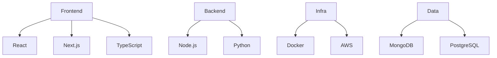

<div align="center">
  
  
  <h2 style="font-size: 1.5em; margin: 20px 0; color: #9a6fc4;">
    ⚡ Innovative <strong>Software Developer</strong> | <strong>Open-Source Contributor</strong> | <strong>Tech Enthusiast</strong> ⚡
  </h2>    

  <div style="display: flex; justify-content: center; align-items: center; margin: 10px 0;">
      
    <a href="https://twitter.com/hari_om_pandit">
      
    </a>
    <a href="https://github.com/hari7261">
      
    </a>
  </div>
</div>

[](https://holopin.io/@hari7261)

<div align="center">
    <a href="https://drive.google.com/file/d/1qgMBBKtVRqKmAtQSfjwkeyna9KjNZ7L2/view?usp=sharing" target="_blank" style="color: #9a6fc4; font-weight: bold; text-decoration: none; margin-left: 10px;">
      📄 Resume
    </a>
</div>

---
<div align="center">
  
# 🚀 Digital Craftsmanship | My WorkShop

<a href="https://www.dreamsbuilder.tech" target="_blank">
  
</a>

<br/>

[](https://www.dreamsbuilder.tech)

<br/>

```typescript
interface DigitalExperience {
  creativity: 'unlocked';
  functionality: 'optimized';
  code: 'elegant';
  design: 'intentional';
  result: 'visionRealized';
}
```
</div>

---
## 🛠️ **Tech Stack Explorer**

<div align="center">
  

## ⚡ Powering Digital Experiences With
<p align="center">          </p></div>

---
</div>


## 🏆 **Achievements**  
<p align="center">
  
</p>

---
## GitHub Streak Tracker (Current Streak)
<div align="center">

</div>

---
## Stats
<div align="center">
  


</div>

---

## 🔗 **Let's Connect!**  
<div align="center">
  <a href="https://twitter.com/hari_om_pandit"></a>
  <a href="https://linkedin.com/in/hariom-kumar-pandit-2k3"></a>
  <a href="https://stackoverflow.com/users/25647652/hariom-pandit"></a>
  <a href="https://www.codechef.com/users/hariompandit55"></a>
  <a href="https://www.hackerrank.com/hariompandit5556"></a>
  <a href="https://www.leetcode.com/hariompandit5556"></a>
  <a href="https://auth.geeksforgeeks.org/user/hariompanxpi8"></a>
</div>

---


<div align="center">


  
[](https://github.com/ashutosh00710/github-readme-activity-graph)

</div>

---

## ⚡ **Fun Fact**  
I’m always curious about learning new technologies, and my passion for tech grows stronger every day! 😎

---

<footer align="center" style="padding: 20px; background-color: #7a4f8f; border-radius: 10px; margin-top: 20px;">
  <p style="color: white; font-size: 1.2em; margin: 0;">🚀 <strong>Follow Me on GitHub:</strong></p>
  <a href="https://github.com/hari7261" style="text-decoration: none; color: #9a6fc4; font-weight: bold; font-size: 1.5em;">
    
    Hariom Kumar Pandit
  </a>
  <p style="color: white; font-size: 0.9em; margin-top: 10px;">Made with ❤️ by Hariom Kumar Pandit</p>
</footer>
